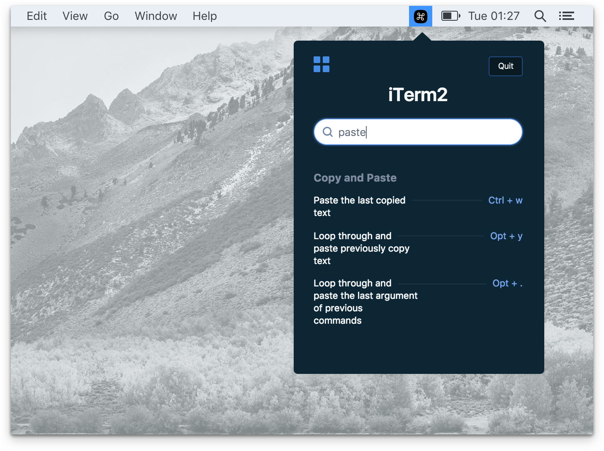

<p align="left">
  <a href="https://www.amie-chen.com/pretzel/" target="_blank">
    
  </a>
</p>

Pretzel is Mac desktop app that shows and search keyboard shortcuts based on your current app. [Checkout the lading page here.](https://www.amie-chen.com/pretzel)

## Features

* 🔍 In-App quick search: Find your specific shortcut with quick search among hundreds.
* ⚡ Detects the currently focused app.
* 🐠 Little distraction from your current task. Clicking on the menubar icon or hit `CmdorCtrl + (backtick)` on keyboard will automatically opens the shortcut panel.



## Download for Mac

[Download the latest release](https://github.com/amiechen/pretzel/releases/tag/v0.5.0)

## Run it locally (if you are curious):

```
npm install
npm start
```

To compile:

```
npm run build:mac
npm run build:win
```

## Add a shortcut:

If you **have** github account, please read [the Contributing doc here](./docs/CONTRIBUTING.md)

If you **don't have** a github account, please follow these steps:

* 1.  Create a text file with <your-app-name>.yml as the file name. For example, `Photoshop.yml`.
* 2.  Find your app's shortcuts on the web and add them to your `.yml` file, in the same format as the files in `/shortcuts` folder.
* 3.  Send me the `.yml` file so I could add it in.

## License

MIT © [Amie Chen](https://amie-chen.com)
